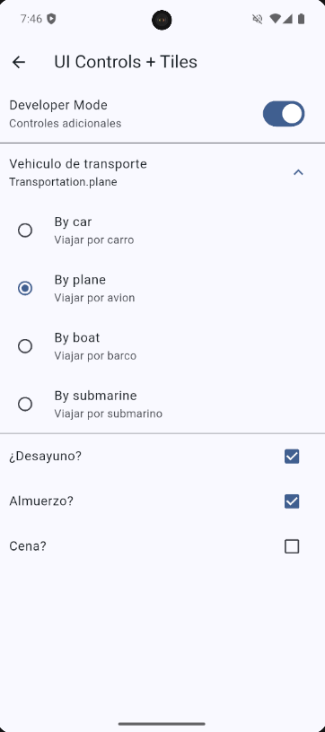
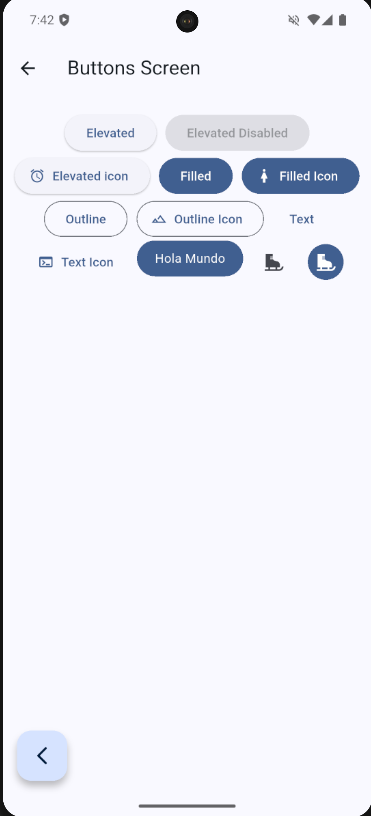
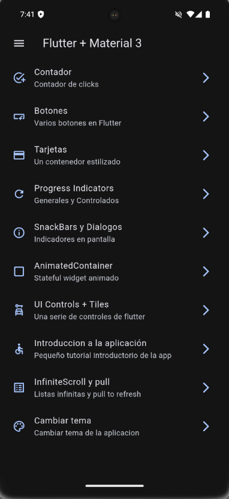
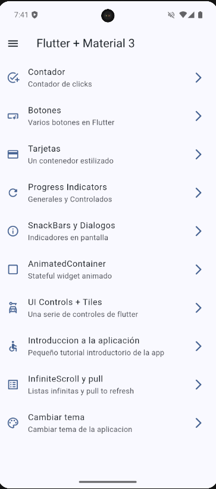
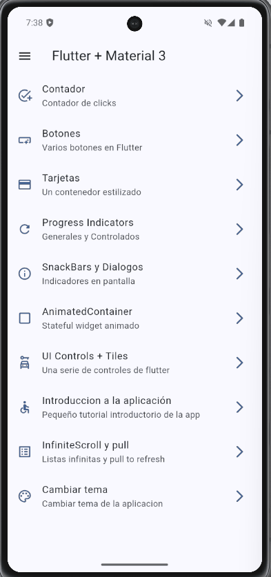
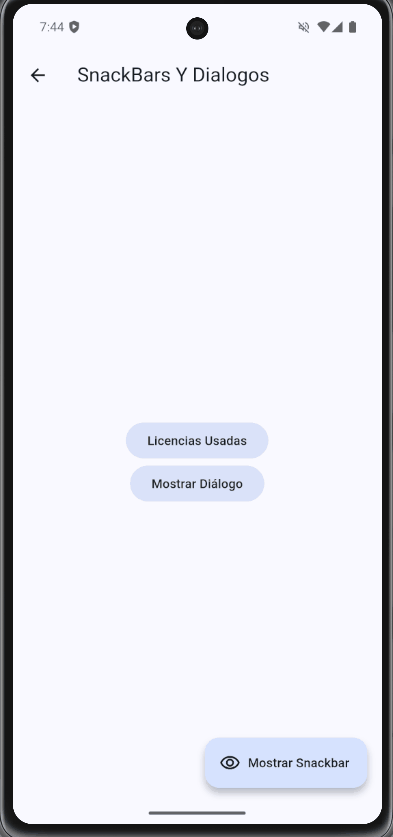
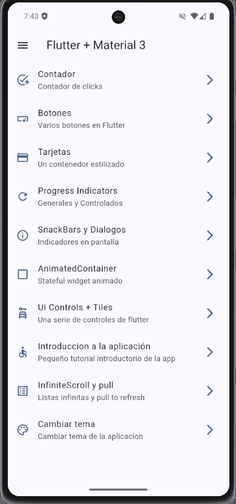
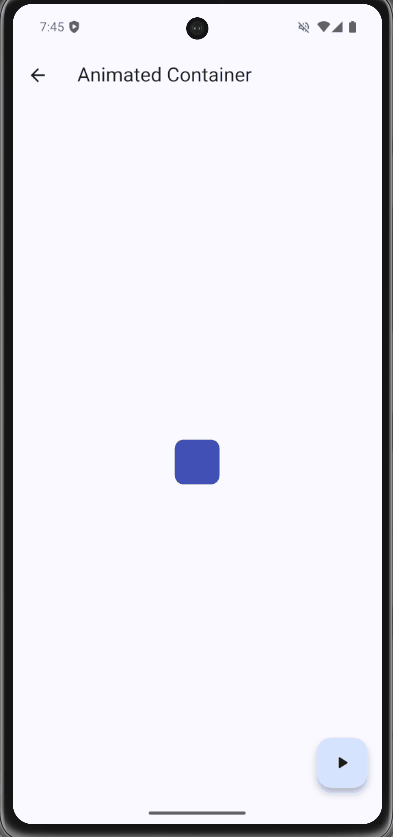

# 🚀 Widgets App - Flutter Showcase

Una aplicación en Flutter que sirve como catálogo interactivo de widgets, animaciones, temas, manejo de estado y más. Ideal para estudiantes, desarrolladores que inician en Flutter o para uso como referencia de buenas prácticas.

## ✨ Características

- ✅ Modo oscuro/claro con Riverpod
- 🎨 Personalización de temas y colores
- ⚙️ Ejemplos interactivos de widgets
- 🧠 Manejo de estado con `StateNotifierProvider`
- 🔍 Navegación limpia y estructurada
- 🧩 Componentes reutilizables
- 🧪 Lista para pruebas unitarias

## 📸 Capturas y Demos de la App

### 🎛️ UI Controls



### 🔘 Botones personalizados



### 🔢 Contador con manejo de estado


### 🌑 Modo Oscuro activado



### ☀️ Modo Claro activado



### 🎨 Control de Tema en tiempo real



### 🔄 Scroll Infinito con carga dinámica


### 📦 Snackbars con acciones contextuales



### 🌀 Indicadores de progreso animados



### 🧱 Uso de AnimatedContainer



## 🚀 ¿Cómo correrla?

```bash
git clone https://github.com/JuanMiguelUribe/widgets_app.git
cd widgets_app
flutter pub get
flutter run
```

## 🧑‍💻 Sobre el desarrollador

Hecha por [Juan](https://github.com/JuanMiguelUribe), Ingeniero Mecatrónico y desarrollador entusiasta de apps móviles y análisis de datos.
